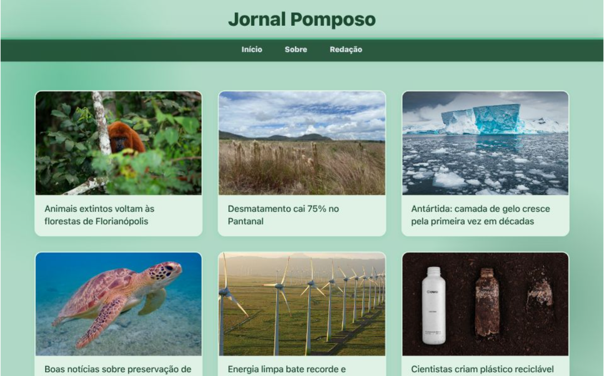

  

# 🌱 Blog da Sustentabilidade

Bem-vindo(a) ao repositório do **Blog da Sustentabilidade**!  
Este projeto tem como objetivo divulgar conteúdos sobre meio ambiente, ecologia, consumo consciente e boas práticas sustentáveis. É um blog colaborativo e educativo, ideal para quem está começando a programar e quer aprender mais sobre desenvolvimento web e trabalho em equipe.

---

## Link do site
<a href="https://jornalpomposo-final.vercel.app/">Jornal Pomposo</a> 

## 💚 Feito com carinho por pessoas que acreditam em um mundo mais sustentável
